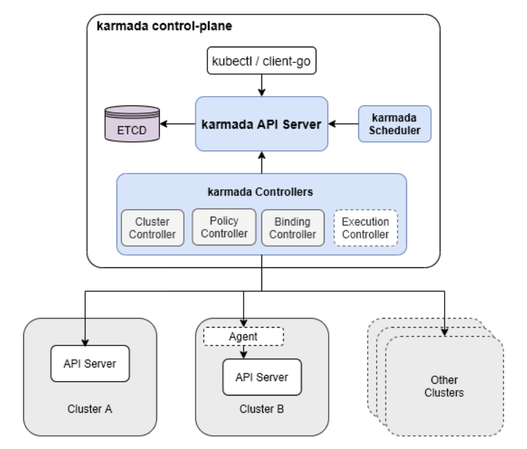
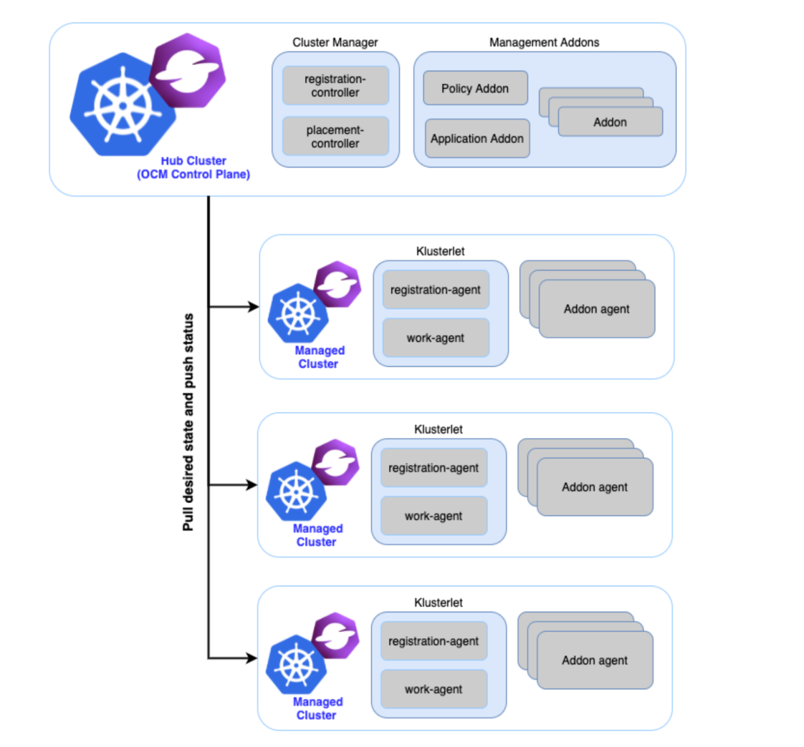
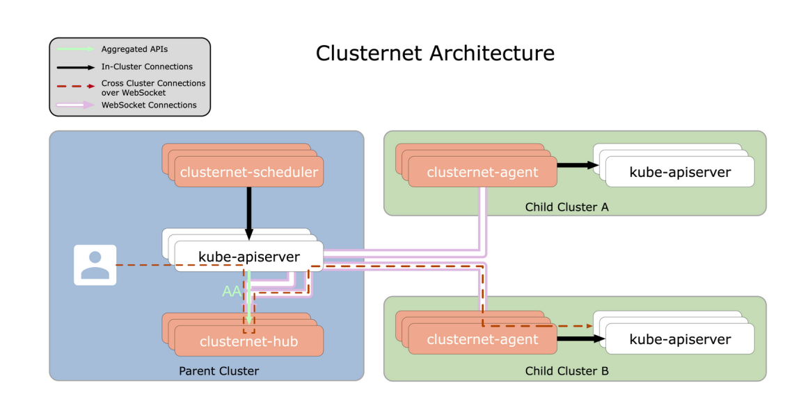
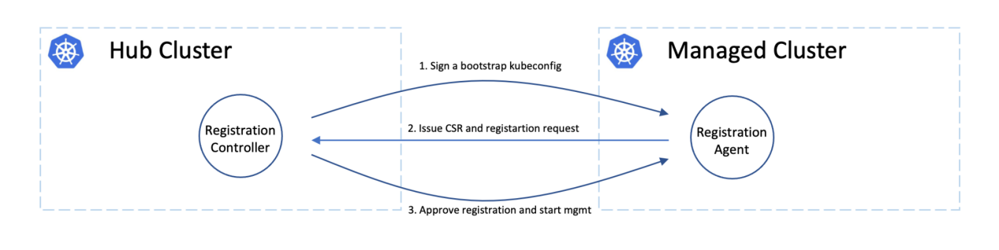
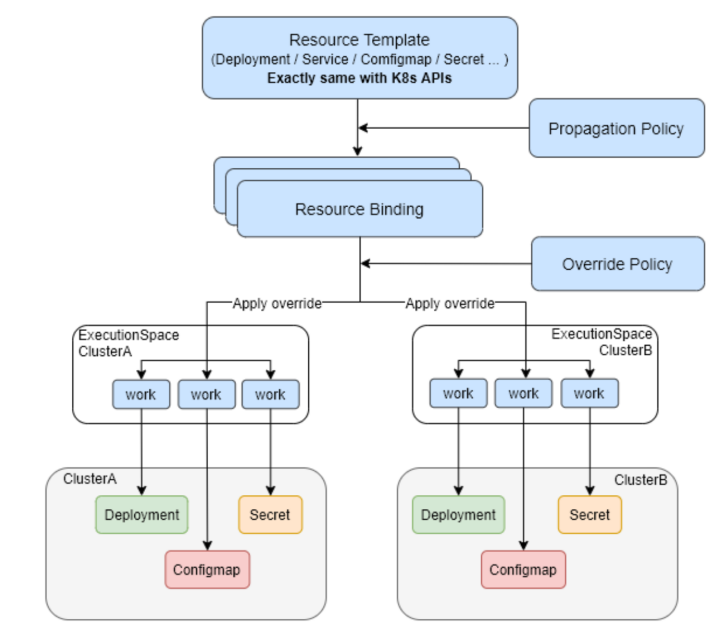
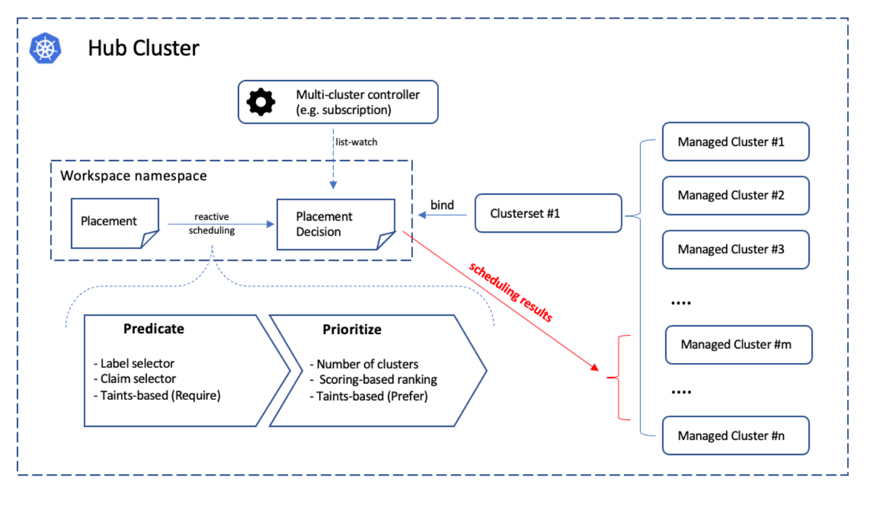

# 三个CNCF 多集群管理项目介绍（Clusternet, Karmada, OCM）


随着 Kubernetes 的不断成熟，它已经成为云原生技术的基石，并被广泛应用于生产环境中，用于基础设施管理和应用资源。根据 CNCF 基金会的数据，目前使用 Kubernetes 作为容器管理工具的企业已经超过了一半。

随着 Kubernetes 的普及，单个 Kubernetes 集群的限制越来越明显。因此，有些业务需要在多个 Kubernetes 集群上进行部署和管理，这就需要使用多集群管理技术。

国内外厂商和开源社区率先发布并开源了 Karmada、Open Cluster Management（OCM）项目和 Clusternet 项目。这三个项目都已经捐赠给 CNCF，成为 CNCF 的沙盒项目，并已在许多场景下得到广泛应用。


下面，我们从三个维度对比一下这三个多集群管理项目：
1. 架构设计
2. 集群生命周期管理
3. 应用分发

## 1. 架构设计

### 1.1 karmada


#### Karmada Control Plane 
- Karmada API Server
- Karmada Controller Manager
    主要运行了以下控制器，每个控制器分别监听不同的karmada 对象，然后通过被管理集群的api server创建对应的kubernetes 资源。
    - Cluster Controller: 将一个成员集群添加到Karmada, 并通过创建cluster 对象，管理集群的生命周期。
    - Policy Controller: 监听PropagationPolicy 对象，PropagationPolicy 对象被创建后，Policy Controller会选择一组匹配resourceSelector 的资源，然后为每个单独则资源创建ResourceBinding。
    - Binding Controller: 监听ResourceBinding 对象，然后创建每个集群对应的work 对象。work 对象里面包含了一个具体的资源
    - Execution Controller: 监听work对象，然后在member cluster 里创建对应的资源

- Karmada Scheduler
    负责从集群联邦中选择一部分成员集群，运行用户提交的k8s原生API资源对象（包括CRD资源）

#### Karmada Agent
运行在成员集群中，在pull模式下负责与Karmada Control Plane 通信，负责集群的状态汇报和资源的创建。


### 1.2 Open Cluster Management (OCM)


OCM 有着很好的模块化和可扩展性，除了最核心的集群注册组件外，其他部分均可以实现自由拔插。非常适合轻量化安装和二次开发。
#### Hub Cluster(OCM Control Plane )
表示运行着OCM多集群控制平面的集群。通常hub cluster应该是一个轻量级的Kubernetes集群，仅仅托管着一些基础的控制器和服务。hub cluster上运行如下的组件：
- registration controller: 负责集群生命周期的核心模块。负责被管理集群的注册和健康状况。

- (可选) placement controller: 通过用标签（labels）或集群声明（cluster-claims）的方式对集群进行分组，进行跨集群构建自定义高级拓扑。 placement模块和执行是完全解耦的，placement的输出结果仅为PlacementDecisionAPI中匹配的集群名字列表，因此该决策输出的消费者控制器（consumer controller），可以通过简单的查看决策API，来发现拓扑或发现manaegd cluster上的可用变化。

- (可选) management addons:除了最基本的集群注册组件外，OCM 其他的功能基本都是通过插件实现的，用户可以选择性的安装。此外OCM 还提供了接口，用户还可以自己开发想要的插件。OCM还默认提供了很多插件来满足多集群管理需求。

#### Klusterlet（agent）:
klusterlet 负责主动从hub cluster 拉取最新的资源，并持续将物理的Kubernetes集群调和到预期状态。

klusterlet: 运行的组件如下：
- registration agent: 向hub cluster 注册被管理集群，并汇报被管理集群的心跳信息。
- （可选）work agent: 监听hub cluster 上被管理集群namespace 中的work 资源，并将work 中定义的资源应用到当前被管理集群中。
- （可选）addon agent: 用户可以通过实现addon接口，实现自定义插件，插件需要监听hub cluster上被管理集群的namespace 中定义的addon 资源，并将根据监听到的资源在当前被管理集群上执行相应的操作。


### 1.3 Clusternet



#### clusternet-hub
 组件部署和运行在父集群中，通过 Aggregated APIServer 的方式进行工作，主要负责：
- 批准各个子集群注册请求，并为子集群创建专用资源，例如 namespace、ServiceAccount 和 RBAC 规则等
- 作为聚合的 apiserver，用作 websocket 服务器，维护来自子集群的多个 websocket 连接
- 提供 Kubernstes 风格的 REST API 来重定向/代理/升级请求到每个子集群 （ 从一组 API 协调应用程序并将其部署到多个集群； 

#### clusternet-agent 
部署在各个子集群中，主要负责：
- 将当前集群作为子集群自动注册到父集群并上报集群元信息，包括 Kubernetes 版本、运行平台、healthz/readyz/livez 健康状态、节点状态等
- 与父集群建立一个 TCP 全双工的 websocket 安全隧道连接

## 2. 集群生命周期管理
### 2.1 karmada: 
karmada的成员集群支持push和pull两种模式：

- Push 模式：
    karmada会在每个成员集群中创建service account，并为该service account配置cluster role和cluster role binding。这个service account令karmada控制面有权将应用资源对象下发到成员集群，并有权访问成员集群apiserver的/readyz或/healthz URL，从而判断成员集群的健康状态。karmada还会再控制平面中创建cluster对象，cluster对象是一个成员集群在karmada集群联邦中的代表。cluster 对象中包含了成员集群的apiserver 地址和访问成员集群的secret. 通过这些信息，karmada控制面就可以在成员集群中创建各种资源对象，并访问/readyz、/healthz等URL。
    对于push模式的成员集群来说，在karamada控制面中的karamada controller manager会运行一个cluster status controller


- pull 模式：
    pull模式的成员集群注册目前使用hack/deploy-karmada-agent.sh脚本，用户可以执行如下命令将集群member2集群注册到karmada集群联邦中：

    ```shell
    hack/deploy-karmada-agent.sh ~/.kube/karmada.config karmada-apiserver ~/.kube/karmada.config member2
    ```

    1. 脚本会在成员集群的karmada-system namespace中创建karmada-agent-sa service account并在成员集群中创建cluster role，允许对成员集群所有资源的get、watch、list、create、update和delete操作，以及对/readyz、/healthz等URL的get操作
    2. 在成员集群中创建cluster role binding，绑定上述service account和cluster role
    3. 在成员集群的karmada-sytem namespace中创建名为karmada-kubeconfig的secret，这个secret会被mount在下一步启动的karmada agent中，用来访问karmada控制面apiserver。
    对于pull模式的成员集群来说，在成员集群侧运行的karmada agent会运行一个karmada controller manager，而后者会启动一个cluster status controller


### 2.2 OCM


OCM 中非常注意集群的安全性，在集群注册中采用了“双重确认握手”

事实上，hub cluster和managed cluster可以为不同的管理员所有并维护，所以在OCM中，清楚的分离了这两种角色，并使集群注册需要双方的批准，以防一些不受欢迎的请求。

在中止注册方面，hub管理员可以通过拒绝集群证书的轮换来踢出已注册的集群，而从managed cluster管理员的角度来看，他可以通过暴力删除代理实例或撤销代理的RBAC授权的方式，来中止注册。请注意，hub控制器将自动为新注册的集群准备环境，并在踢出managed cluster时自动清理环境。

Kubernetes具有原生的，命名空间粒度的多租户软隔离，所以在OCM中，对于每一个managed cluster，提供一个专用的命令空间，并授予足够的RBAC权限，以便klusterlet可以在hub cluster上保存一些数据。这个专门的命名空间即“集群命名空间”，其主要用于保存来自hub的处方。比如，可以在“集群命名空间”内创建ManifestWork，从而向对应集群部署资源。 同时，集群命名空间也可以用于保存从klusterlet上传的统计信息，例如插件的健康信息等。

在OCM 中，hub control plane 和klusterlet 都可以通过hosting 模式部署。从而达到push mode 的效果。这种分开部署还能够将控制逻辑和workload 分离。

### 2.3 clusternet
Clusternet 类似 OCM 实现双向控制。
在子集群中部署 clusternet-agent，帮助子集群注册到父集群，clusternet-agent 可以配置以下三种同步模式（通过标志 --cluster-sync-mode 配置）：
- Push（推） 模式是指父集群的所有资源变化将由 clusternet-hub 自动同步、推送并应用到子集群
- Pull（拉） 模式表示 clusternet-agent 将自动 watch、同步和应用所有从父集群到子集群的资源变化
- Dual 推拉结合模式，这种模式强烈推荐，通常与特性 AppPusher 一起使用

## 3.应用分发
### 3.1 karmada:


- 资源模板（Resource Template）
    
    这里的 ResourceTemplate 只是对 Karmada 可分发的资源对象的一种抽象，这里的 Resource 包含 Kubernetes 中所有支持的资源对象的类型，包括常见的 Deployment，Service，Pod，Ingress，PVC，PV， Job 等等，同时也原生的支持 CRD

- 分发策略（Propagation Policy）

    PropagationPolicy 的作用主要是，为了定义资源对象被下发的策略，如下发到哪些集群，以及下发到这些集群中的需要计算资源的工作负载的副本数应该怎样分配。PropagationPolicy 是怎样知道自己的策略是作用于哪些资源对象的，这里有一个 resource selector，使用这个选择器去查找和匹配应该被匹配的资源对象，将按照这个 PropagationPolicy 定义的策略进行下发。分发策略支持集群名称， LabelSelector、FieldSelector 和 ExcludeClusters等。

- 差异化策略（Override Policy）

    OverridePolicy 的作用是，定义在下发到不同集群中的配置，可以是不一样的，例如不同的集群所对应的镜像仓库的地址是不一样的，那就需要设置在不同集群中的工作负载的镜像地址是不一样，例如在不同的环境下，需要设置不同的环境变量等。OverridePolicy 的作用时机是在 PropagationPolicy 之后，以及在真正在下发到集群之前，主要处理逻辑是 binding controller 中处理的，会在后续的篇幅中提到。其中可以使用的 override 的能力目前包括 Plaintext，ImageOverrider，CommandOverrider，ArgsOverrider 这几种，用来完成不同集群的差异化配置能力。同样，OverridePolicy 也会通过 resource selector 的机制来匹配到需要查建议配置的资源对象。

- ResouceBinding

    ResourceBinding 这个 crd 不是用于给最终用户使用的，而是 Karmada 自身机制工作需要的，主要的用途是说明了某一个资源被绑定到了哪个集群上了，这个和集群绑定的逻辑是在 detector 的 PropagationPolicy 的 controller 中来控制，可以理解成 ResourceBinding 是 PropagationPolicy 派生出来的一个 cr 对象。同时 Karmada 的调度器的处理对象就是以一个 ResourceBinding 为处理单元，在此基础上来完成资源对象所需要副本数的计算和调度，最终会由 binding controller 完成对 ResourceBinding 的处理，从而生成 Work 对象，同步下发到对应的集群上。

- Work

    Work 这个对象代表了所有资源对象，以及所有资源对象需要下发到多个集群的时候所对应的业务模型。举例来说，一个 Deployment 需要下发到两个集群中去，那对应到这个 Deployment 的 work 的对象就会有两个，因为 work 是集群单位的对象，主要的作用就是对应和代表一个资源对象在一个集群中的逻辑对象。这个逻辑对象 (work)，它保存在控制平面，这里就是 Karmada 在做多集群下发中完成 Host Cluster 和 Workload Cluster 之间真正业务能力的体现。


## 3.1 OCM:


OCM应用分发主要分为三个部分

- 集群分组(ManagedClusterSet )

    ManagedClusterSet 是一个在hub集群cluster scope 的api， 他能够通过集群上的label 将集群分组，从而 hub admin 能够对这组集群通过ManagedClusterSetBinding资源进行权限管理。比如，hub admin 能够定义只有特定用户/用户组可以在一组集群上分发应用。

- 目标集群选择（Placement）

    Placement用来从一个或多个managedclustersset 中选取一组目标集群。选出的结果会被存储到另一个叫PlacementDecision的api。placement 从三个维度定义了目标集群的选择：
        
    - Predicates（requiredClusterSelector）：Predicates中可以定义一组labelSelector和claimSelector。即可以通过集群的label 和集群claim 信息选择目标集群。
    
    - Taints/Tolerations：通过Taints/Tolerations，用户可以避免选择到一些不健康或者不可达的集群。用户还可以定义自己的taint从而避免特定属性的集群被选择。这对用户想要设置一个集群为maintenance mode，然后在这个集群上清楚负载是非常有用。

    - Prioritizers：在Prioritizers里，用户可以定义优先选择哪些目标集群。比如用户可以优先选择3个cpu和memory使用率低的集群。用户还可以通过AddOnPlacementScore来自定义优先级策略。


- 目标集群应用分发(ManifestWork)

    ManifestWork中定义了一组kubernetes资源，在一个集群命名空间中创建这个manifestwork，目标集群中运行的work agent 就会监听到这些资源，并将这些资源应用到目标集群中。manifestwork的status中还能够看到每个资源的应用状态。

## 3.3 Clusternet

Clusternet 资源分发模型采用松耦合的设计，用户无须更改或重新编写已有的资源对象，仅需要额外定义分发策略 （Subscription）和差异化配置（Localization/Globalization）即可实现多集群的应用分发。

- Localization 与 Globalization

    在 Clusternet 中，每个注册的集群，都会拥有一个专属的 namespace (命名空间)，因此我们分别定义了 Localization 和 Globalization 这两个 CRD 用于声明差异化配置。其中 Localization 描述 namespace-scoped （命名空间作用域）的差异化配置策略，可用于对单个集群进行配置，比如 Deployment 在这个集群中的副本数目等。而 Globalization 描述 cluster-scoped （集群作用域） 的差异化配置策略，比如修改某个 HelmChart 的通用配置等。

- Override 策略

    Clusternet 还提供了两种 Overide 策略：ApplyLater（默认的策略）和 ApplyNow。ApplyLater 意味着该 Localization/Globalization 的差异化配置不会立即应用到资源上，只会在随后新创建出来的 Description 对象或者 HelmChart/Subscription/Description 等各个资源对象更新的时候才生效。而 ApplyNow 意味着会创建后即时生效，Clusternet 会将定义的差异化配置应用到所有匹配的对象中，即时下发到对应的子集群中。
- Priority 优先级

    Globalization 和Localization 均支持按照 Priority（优先级）进行管理和配置，优先级的高低通过 0-1000 的数值来定义，值越小，优先级越低，默认是500。在进行差异化渲染的时候，Clusternet 会按照 Globalization (低优先级) -> Globalization (高优先级) -> Localization (低优先级) -> Localization (高优先级) 的次序，依次将声明的 Override 进行 apply。
    正是借助于这种两阶段基于优先级（two-stage priority based）的差异化配置能力，Clusternet 可以很方便地支持面向多集群的蓝绿发布、金丝雀发布、版本升级等场景。在使用过程中， 你可以定义多个 Globalization 和 Localization 对象，并设置不同的优先级策略。


## 总结

可以看出三个项目都能够很好的进行多集群管理和多集群中的应用分发。不同的项目又有不同的特点。
1. karmada 能够很好地实现集群管理和应用分发，并且支持对不同集群进行不同的配置。项目很容易上手，而且中文文档比较丰富。

2. OCM 有强大的模块化能力和应用调度能力，可以很轻量化的部署。还可以通过自定义插件的方式扩展更多功能。非常适合二次开发和大规模应用。OCM已经开发了很多插件来实现各种常用功能。
    - [ocm 与argo 集成，实现多集群应用管理](https://github.com/mikeshng/argo-workflow-multicluster)
    - [ocm policy 插件实现多集群安全策略管理](https://github.com/stolostron/governance-policy-addon-controller)
    - [ocm submarier 实现多集群网络连通](https://github.com/stolostron/submariner-addon)
    - [ocm 还能够通过插件与clusternet 集成，实现优势互补](https://blog.51cto.com/u_14120339/3757951)

3. clusternet 在应用分发时，可以通过Override 策略和priority对集群进行差异化配置，Clusternet 可以很方便地支持面向多集群的蓝绿发布、金丝雀发布、版本升级等场景。
